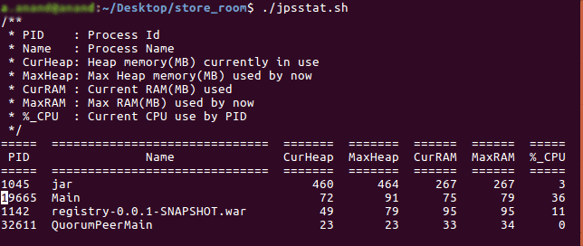

# jps_stat

###### A bash script to moniter **current_heap_memory** , **max_heap_till_now** , **current_ram** , **max_ram_used** , **current_cpu_by_jvm** details of all java programs running on current linux system.

## How to use
* Clone this repo and extract and open the folder
* Right click on ` jpsstat.sh ` file and select ` properties `
* Under ` Permissions ` tab, check the ` Allow executing file as program ` option.
* Now open this folder in terminal and enter ` ./jpsstat.sh `
* This will list the  **current_heap_memory** , **max_heap_till_now**, **current_ram_use**, **max_ram_used** and **current_cpu_use** of all running java processes on your linux system with live refresh.

## Options
This tool expects options in ` ./jpsstat.sh [option] ` format.
* ` -l ` : use this option to display the full package name for the application's main class or the full path name to the application's JAR file
* ` -h ` : display the help details. You can also use ` -help `

Example: `./jpsstat.sh -l ` or `./jpsstat.sh -h`

## How to stop
* Press ` ctrl+c ` to stop the script and enter ` reset ` to clear your screen

## Output

## Script details
* This uses ` jps ` command to get the list of all processes running java programs (_jvm instances_)
* Then for each _process_id_ obtained from jps, it runs ` jstat -gc <process_id> `
* It calculates Heap memory by adding following fields of ` jstat -gc ` output - 
  * ` S0U `: Survivor space 0 utilization
  * ` S1U `: Survivor space 1 utilization
  * ` EU ` : Eden space utilization
  * ` OU ` : Old space utilization
* It tracks cpu uses using ` ps -p <process_id> -o %cpu ` command 
* It uses the ` rss ` field of the output of ` /proc/<pid>/statm ` command to get the memory(RAM) used by the java process.
* It uses ` tput cuu <# of lines> ` to refresh screen
* All the decimal values in the output is truncated using ` %.* `

## Troubleshooting
1.  Getting error as ` ./jpsstat.sh: 38: ./jpsstat.sh: Syntax error: "(" unexpected `
    - Make sure you run the script as ` ./jpsstat.sh ` and not as ` sh ./jpsstat.sh `
    - Use ` bash --version ` to make sure your bash version is >= 4.0
2. Getting error as ` bash: ./jpsstat.sh: Permission denied `
    - Make sure you have given the permission to the "jpsstat.sh" file to execute as program.
    - Either use ` chmod 777 jpsstat.sh ` command or follow *[How to use](https://github.com/amarjeetanandsingh/jps_stat#how-to-use)* section to give execute permission to script file.

## Requirements
* Jdk
* Linux System _(Tested on Ubuntu 16.04 LTS)_
* Bash version >=  4.0

## License
MIT License

Copyright (c) 2017 Amarjeet Anand

Permission is hereby granted, free of charge, to any person obtaining a copy
of this software and associated documentation files (the "Software"), to deal
in the Software without restriction, including without limitation the rights
to use, copy, modify, merge, publish, distribute, sublicense, and/or sell
copies of the Software, and to permit persons to whom the Software is
furnished to do so, subject to the following conditions:

The above copyright notice and this permission notice shall be included in all
copies or substantial portions of the Software.

THE SOFTWARE IS PROVIDED "AS IS", WITHOUT WARRANTY OF ANY KIND, EXPRESS OR
IMPLIED, INCLUDING BUT NOT LIMITED TO THE WARRANTIES OF MERCHANTABILITY,
FITNESS FOR A PARTICULAR PURPOSE AND NONINFRINGEMENT. IN NO EVENT SHALL THE
AUTHORS OR COPYRIGHT HOLDERS BE LIABLE FOR ANY CLAIM, DAMAGES OR OTHER
LIABILITY, WHETHER IN AN ACTION OF CONTRACT, TORT OR OTHERWISE, ARISING FROM,
OUT OF OR IN CONNECTION WITH THE SOFTWARE OR THE USE OR OTHER DEALINGS IN THE
SOFTWARE.

